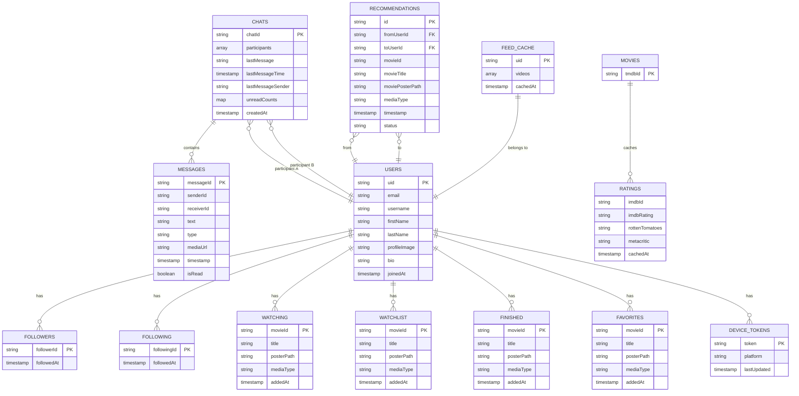

# Finishd - Architecture & Database Documentation

**Prepared for:** Client Review  
**Version:** 1.0  
**Date:** December 4, 2025

---

## 1. System Architecture Diagram

The following diagram illustrates the overall architecture of the Finishd application, showing how the Flutter mobile app connects to Firebase backend services and external APIs.

```mermaid
flowchart TB
    subgraph CLIENT["📱 Client Layer"]
        APP["Flutter Mobile App<br/>(iOS / Android)"]
    end

    subgraph FIREBASE["☁️ Firebase Backend"]
        AUTH["Firebase Auth<br/>• Email/Password<br/>• Google Sign-In<br/>• Apple Sign-In"]
        FIRESTORE["Cloud Firestore<br/>• User Data<br/>• Chats & Messages<br/>• Movie Lists<br/>• Recommendations"]
        STORAGE["Firebase Storage<br/>• Profile Images<br/>• Media Files"]
        FCM["Firebase Cloud Messaging<br/>• Push Notifications<br/>• Topic Subscriptions"]
    end

    subgraph EXTERNAL["🌐 External APIs"]
        TMDB["TMDB API<br/>• Movie/TV Data<br/>• Trailers<br/>• Cast & Crew<br/>• Streaming Providers"]
        OMDB["OMDb API<br/>• IMDb Ratings<br/>• Rotten Tomatoes<br/>• Metacritic Scores"]
        YOUTUBE["YouTube<br/>• Video Feed Content<br/>• Trailer Playback"]
    end

    APP <-->|Authentication| AUTH
    APP <-->|Real-time Data| FIRESTORE
    APP <-->|File Upload/Download| STORAGE
    APP <-->|Notifications| FCM
    
    APP -->|Movie Data Requests| TMDB
    APP -->|Ratings Requests| OMDB
    APP -->|Video Extraction| YOUTUBE
    
    FIRESTORE -.->|Trigger| FCM

    style CLIENT fill:#E3F2FD,stroke:#1976D2,stroke-width:2px
    style FIREBASE fill:#FFF3E0,stroke:#FF9800,stroke-width:2px
    style EXTERNAL fill:#E8F5E9,stroke:#4CAF50,stroke-width:2px
```

---

## 2. Detailed Service Integration

---

## 3. Database Schema (Firestore)

### Collection Structure Overview

---

## 4. Firestore Collections Hierarchy

---

## 5. Data Flow Diagrams

### 5.1 User Authentication Flow

### 5.2 Chat Message Flow

### 5.3 Movie Details & Ratings Flow

---

## 6. Security Rules Summary

| Collection | Read | Write |
|-----------|------|-------|
| `users/{userId}` | Any authenticated user | Owner only |
| `users/{uid}/followers` | Any authenticated user | Follower (self-add) |
| `users/{uid}/following` | Any authenticated user | Owner only |
| `users/{uid}/[movie lists]` | Any authenticated user | Owner only |
| `chats/{chatId}` | Participants only | Participants only |
| `chats/{chatId}/messages` | Participants only | Sender must be participant |
| `movies/{id}/ratings` | Any authenticated user | Any authenticated user |
| `feed_cache/{userId}` | Owner only | Owner only |
| `recommendations` | Any authenticated user | Any authenticated user |

---

## 7. External API Integration Summary

| API | Purpose | Data Retrieved |
|-----|---------|----------------|
| **TMDB** | Movie & TV Show data | Titles, posters, synopses, cast, crew, trailers, streaming providers, trending, discover |
| **OMDb** | Aggregated ratings | IMDb rating, Rotten Tomatoes score, Metacritic score |
| **YouTube** | Video content | Trailers, personalized video feed content |

---

## 8. Technology Stack Summary

---

*Document prepared for architectural review - December 4, 2025*
