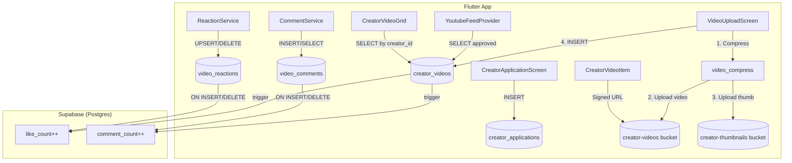

# Content Creator System — Full Documentation

## Overview

The content creator system lets users apply for creator status, upload short-form video reviews tagged to TMDB titles, and surface them in the TikTok-style feed. It spans **6 Dart files** on the app side and **5 database tables** (plus 2 storage buckets) on the Supabase side.

---

## Architecture Diagram



---

## 1. Creator Application Flow

### App: [creator_application_screen.dart](file:///Users/kobby/Desktop/finishd/finishd/finishd_supabase/lib/screens/creator_application_screen.dart)

**Purpose:** Users apply for creator access. Until approved, they cannot upload videos.

**Fields collected:**
| Field | Column | Type |
|-------|--------|------|
| Display Name | `display_name` | `TEXT` |
| Bio | `bio` | `TEXT` (max 150) |
| Content Type | `content_intent` | `TEXT[]` (Reviews/Clips/News) |
| Portfolio | `external_links` | `JSONB` |

**DB interaction:**
```dart
await supabase.from('creator_applications').insert({
  'user_id': user.id,
  'display_name': ...,
  'bio': ...,
  'content_intent': [_selectedContentType],
  'external_links': {'portfolio': _portfolioController.text},
  'status': 'pending',
});
```

**After submit:** User sees "Application Under Review" dialog. Admin reviews and updates `status` → `'approved'` / `'rejected'`.

### DB: `creator_applications` table

| Column | Type | Notes |
|--------|------|-------|
| `id` | UUID PK | Auto-generated |
| `user_id` | UUID FK → profiles | Applicant |
| `display_name` | TEXT | |
| `bio` | TEXT | |
| `content_intent` | TEXT[] | What they plan to create |
| `external_links` | JSONB | Portfolio/social links |
| `status` | TEXT | `pending` → `approved` / `rejected` |
| `reviewed_by` | UUID FK → profiles | Admin who reviewed |
| `created_at` / `updated_at` | TIMESTAMPTZ | Auto-managed |

**RLS:** Users insert own. Users read own. Admins read/update all.

---

## 2. Video Upload Pipeline

### App: [video_upload_screen.dart](file:///Users/kobby/Desktop/finishd/finishd/finishd_supabase/lib/screens/video_upload_screen.dart)

**Step-by-step flow:**

```
1. User picks video from gallery (max 60s)
2. User picks a cover image (thumbnail)
3. User searches TMDB and tags a title (optional)
4. User writes caption + spoiler toggle
5. → _submitVideo() executes:
```

### `_submitVideo()` — The core upload method

| Step | What happens | Destination |
|------|-------------|-------------|
| **0** | Compress video (`VideoCompress.compressVideo`, MediumQuality) | Local |
| **1** | Upload video file → Supabase Storage | `creator-videos/{userId}/{timestamp}.mp4` |
| **2** | Upload thumbnail → Supabase Storage | `creator-thumbnails/{userId}/{timestamp}.jpg` |
| **3** | Extract hashtags from caption via regex | In-memory |
| **4** | INSERT row into `creator_videos` table | Supabase DB |

**DB insert payload:**
```dart
await supabase.from('creator_videos').insert({
  'creator_id': user.id,
  'video_url': videoPath,        // Relative path, NOT full URL
  'thumbnail_url': thumbUrl,     // Full public URL
  'title': _titleController.text,
  'description': _captionController.text,
  'tags': tags,                  // ['#review', '#horror']
  'tmdb_id': _tmdbId,            // int? from TMDB search
  'tmdb_type': _mediaType,       // 'movie' or 'tv'
  'spoiler': _containsSpoilers,
  'duration_seconds': duration,
  'status': 'pending',           // Always starts pending
});
```

### App: [storage_service.dart](file:///Users/kobby/Desktop/finishd/finishd/finishd_supabase/lib/services/storage_service.dart#L250-L296)

| Method | Bucket | Returns |
|--------|--------|---------|
| `uploadCreatorVideo(file, userId)` | `creator-videos` (private) | Relative path (`userId/timestamp.mp4`) |
| `uploadCreatorThumbnail(file, userId)` | `creator-thumbnails` (public) | Full public URL |

> [!IMPORTANT]
> Videos are stored as **relative paths** in the DB (e.g., `abc123/1707123456.mp4`).
> The app must generate a **signed URL** at playback time. Thumbnails are public URLs.

### TMDB Tagging: `_TmdbSearchContent` widget

The upload screen has a built-in TMDB search bottom sheet:
- Uses `Trending.searchMedia(query)` with 500ms debounce
- Returns a `MediaItem` with `id`, `mediaType` (`movie`/`tv`), and `title`
- Saved as `tmdb_id` + `tmdb_type` on the video row

---

## 3. Database Schema — `creator_videos`

Defined in [20250215000005_creator_videos.sql](file:///Users/kobby/Desktop/finishd/finishd/finishd_supabase/supabase/migrations/20250215000005_creator_videos.sql)

| Column | Type | Default | Notes |
|--------|------|---------|-------|
| `id` | UUID PK | `gen_random_uuid()` | |
| `creator_id` | UUID FK → profiles | | NOT NULL |
| `video_url` | TEXT | | Relative storage path |
| `thumbnail_url` | TEXT | | Public URL |
| `title` | TEXT | | User-provided or TMDB title |
| `description` | TEXT | | Caption with hashtags |
| `tags` | TEXT[] | | Extracted hashtags |
| `tmdb_id` | INT | | TMDB movie/show ID |
| `tmdb_type` | TEXT | | `'movie'` or `'tv'` |
| `spoiler` | BOOLEAN | `false` | Blur preview for others |
| `duration_seconds` | INT | | Max 60 |
| `status` | TEXT | `'pending'` | `pending` → `approved` / `rejected` / `removed` |
| `reviewed_by` | UUID FK | | Admin who reviewed |
| `rejection_reason` | TEXT | | If rejected |
| `like_count` | INT | `0` | Auto-updated by trigger |
| `comment_count` | INT | `0` | Auto-updated by trigger |
| `view_count` | INT | `0` | Auto-updated by engagement trigger |
| `engagement_score` | NUMERIC(10,4) | `0` | For feed ranking |
| `quality_score` | NUMERIC(10,4) | | ML-assigned |
| `deleted_at` | TIMESTAMPTZ | | Soft delete |
| `created_at` / `updated_at` | TIMESTAMPTZ | `now()` | Auto-managed |

### Key Indexes
```sql
idx_cv_creator      ON creator_videos(creator_id)
idx_cv_status       ON creator_videos(status)
idx_cv_feed         ON creator_videos(status, created_at DESC) WHERE deleted_at IS NULL
idx_cv_tmdb         ON creator_videos(tmdb_id) WHERE tmdb_id IS NOT NULL
idx_cv_engagement   ON creator_videos(engagement_score DESC) WHERE status = 'approved'
```

### RLS Policies
| Policy | Operation | Who |
|--------|-----------|-----|
| Public read approved | SELECT | Anyone (where `status = 'approved'` and `deleted_at IS NULL`) |
| Creators read own | SELECT | Owner (all statuses) |
| Creators insert | INSERT | Auth user with `creator_status = 'approved'` |
| Creators update own | UPDATE | Owner |
| Admins full access | ALL | `role = 'admin'` |

### Triggers
- `moddatetime(updated_at)` — auto-update timestamp
- `handle_reaction_count()` — `like_count` ±1 on `video_reactions` INSERT/DELETE
- `handle_cv_comment_count()` — `comment_count` ±1 on `video_comments` INSERT/DELETE
- `guard_active_user()` — blocks banned/suspended users from writing

---

## 4. Feed Integration

### App: [youtube_feed_provider.dart](file:///Users/kobby/Desktop/finishd/finishd/finishd_supabase/lib/provider/youtube_feed_provider.dart#L141-L265)

Creator videos are merged into the TikTok-style feed in `_fetchTabFeed()`:

```dart
// Fetch approved creator videos with profile join
final response = await supabase
    .from('creator_videos')
    .select('*, profiles!creator_videos_creator_id_fkey(username, avatar_url)')
    .eq('status', 'approved')
    .order('created_at', ascending: false)
    .limit(10);

creatorVideos = response.map((json) => FeedVideo.fromCreatorJson(json)).toList();
```

**Merge strategy:**
| Tab | Behavior |
|-----|----------|
| **Following** | Creator videos first, then YouTube videos |
| **Trending** | Creator + YouTube mixed, then shuffled |
| **For You** | YouTube only (for now) |

### App: [feed_video.dart](file:///Users/kobby/Desktop/finishd/finishd/finishd_supabase/lib/models/feed_video.dart) — `FeedVideo.fromCreatorJson()`

Maps a `creator_videos` DB row to a `FeedVideo`:

```dart
factory FeedVideo.fromCreatorJson(Map<String, dynamic> json) {
  return FeedVideo(
    videoId: json['id'],
    title: json['title'] ?? 'New Post',
    thumbnailUrl: json['thumbnail_url'] ?? '',
    channelName: json['profiles']?['username'] ?? 'Creator',
    description: json['description'] ?? '',
    videoUrl: json['video_url'],  // Relative path for signed URL
    isCreator: true,
    feedType: 'following',
    type: 'creator_video',
  );
}
```

---

## 5. Video Playback

### App: [creator_video_item.dart](file:///Users/kobby/Desktop/finishd/finishd/finishd_supabase/lib/Feed/creator_video_item.dart)

Creator videos use Flutter's `VideoPlayerController` (not YouTube player):

```dart
// If video_url is a relative path (not http://)
videoUrl = await Supabase.instance.client.storage
    .from('creator-videos')
    .createSignedUrl(videoUrl, 60 * 60);  // 1-hour signed URL

_controller = VideoPlayerController.networkUrl(Uri.parse(videoUrl));
```

**Playback features:**
- Auto-play/pause based on `YoutubeFeedProvider.currentIndex`
- Looping enabled
- Thumbnail fallback while loading
- Gradient overlay with `@username` and description

---

## 6. Profile Grid

### App: [creator_video_grid.dart](file:///Users/kobby/Desktop/finishd/finishd/finishd_supabase/lib/profile/creator_video_grid.dart)

Displays a TikTok-style 3-column grid on profile pages:

```dart
final response = await supabase
    .from('creator_videos')
    .select()
    .eq('creator_id', userId)
    .eq('status', 'approved')
    .order('created_at', ascending: false);
```

Each tile shows the thumbnail + view count overlay.

---

## 7. Reactions System

### App: [reaction_service.dart](file:///Users/kobby/Desktop/finishd/finishd/finishd_supabase/lib/services/reaction_service.dart)

| Method | DB Operation | Table |
|--------|-------------|-------|
| `reactToVideo()` | `UPSERT` (on `video_id, user_id`) | `video_reactions` |
| `quickReact()` | → calls `reactToVideo` with `heart`/`❤️` | `video_reactions` |
| `toggleReaction()` | Check existing → remove or upsert | `video_reactions` |
| `removeReaction()` | `DELETE` | `video_reactions` |
| `getUserReaction()` | `SELECT` single | `video_reactions` |
| `getReactionCounts()` | `RPC get_video_reaction_counts` | — |
| `getUserReactionStream()` | `.stream()` | `video_reactions` |

**Reaction types:** `heart`, `laugh`, `wow`, `sad`, `angry`

### DB: `video_reactions` table
```
(id UUID PK, video_id FK, user_id FK, reaction_type TEXT, emoji TEXT, created_at)
UNIQUE(video_id, user_id)  — one reaction per user per video
```

**Trigger:** On INSERT/DELETE → updates `creator_videos.like_count`

---

## 8. Comments System

### App: [comment_service.dart](file:///Users/kobby/Desktop/finishd/finishd/finishd_supabase/lib/services/comment_service.dart)

| Method | DB Operation | Table |
|--------|-------------|-------|
| `addComment()` | `INSERT` + `.select().single()` | `video_comments` |
| `deleteComment()` | `DELETE` | `video_comments` |
| `getComments()` | `SELECT` with pagination, parent filtering | `video_comments` |
| `getCommentsStream()` | `.stream()` real-time | `video_comments` |
| `getCommentCount()` | `SELECT` | `video_comment_counts` (view) |

**Threading:** Comments support `parent_id` for nested replies. Top-level queries filter `parent_id IS NULL`.

### DB: `video_comments` table
```
(id UUID PK, video_id FK, author_id FK, content TEXT, parent_id FK self-ref, deleted_at, created_at, updated_at)
```

**Trigger:** On INSERT/DELETE → updates `creator_videos.comment_count`

---

## 9. Storage Buckets

### Supabase Storage configuration (from [migration 10](file:///Users/kobby/Desktop/finishd/finishd/finishd_supabase/supabase/migrations/20250215000010_realtime_storage.sql))

| Bucket | Public | Write Policy | Read Policy |
|--------|--------|-------------|-------------|
| `creator-videos` | Yes | Creators upload to own folder + must have `creator_status = 'approved'` | Public |
| `creator-thumbnails` | Yes | Creators upload to own folder | Public |

**File naming convention:** `{userId}/{timestamp}.{ext}`

---

## 10. Engagement & Analytics

### DB: `video_engagement_events` (Partitioned by month)

Tracks every view/watch event:
```
(id, video_id, user_id, event_type, watch_duration_seconds, completion_pct, created_at)
```

**Aggregation trigger** (`update_video_daily_stats`):
- On INSERT → increments `creator_videos.view_count`
- On INSERT → upserts `video_daily_stats` (total_views, watch_time, completion)

---

## 11. Content Moderation

### Video lifecycle:
```
pending → approved → (removed)
         → rejected
```

- All videos start as `pending`
- Admin reviews and sets `status` to `approved` or `rejected`
- `reviewed_by` and `rejection_reason` are recorded
- Only `approved` videos appear in feed queries (enforced by RLS + app query filter)
- **Write guard trigger** prevents banned/suspended users from uploading

### Reporting (not yet wired in app)

The `creator_video_reports` table exists in the DB but has no app-side service yet.

---

## 12. Missing / TODO Items

| Feature | Status | Notes |
|---------|--------|-------|
| Video reports UI | ❌ Not built | DB table exists, no Dart service |
| Draft saving | ❌ Not built | Button exists in UI, no logic |
| Admin review screen | ❌ Partial | Previous admin panel referenced but needs updating for V3 |
| View count from client | ❌ Not wired | `video_engagement_events` table exists but no app-side insert |
| Feed ranking by `engagement_score` | ❌ Not wired | Column exists, no scoring logic |
| Hashtag search | ❌ Not built | Tags are stored but not searchable |
